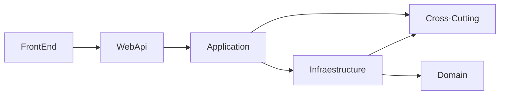

# Inventory Manager

The objective of this application is to manage the inventory of a Hardware Store.

- The user can add, delete or modify a product inventory.
- The user can view a list of inventory items by warehouse or all warehouses

## Status of the demo
In this repo, there is:
- An API for addding, deleting and modify a warehouse inventory, and obtain a list of items.
The data is in-memory, there isn't any access to database.
- This api is secured by Basic Authentication ( **user=admin, passwd=admin** )
- A Test project for testing the API
- There isn't any Frontend, but it uses a Rest Api compatible with most of existing frontends frameworks.

## Architecture
The project is done using a DDD (Domain-Driven Design) aproach.

### FrontEnd layer
Commonly may be a Web Application done in Angular, React or Vue, but it could be done in Desktop (WPF, Forms...) or mobile applications.  
This layer can be tested with test frameworks like Chromium, Cypress or the new PlayWright from Microsoft. 

### WebApi Layer  
Layer used for exposing the application to the FrontEnd or testing api software like Postman, SoapUI, Curl, etc...  
This layer implements Basic Authentication authentication (admin/admin).  
It's docummented by swagger.  
The communication with other layers is using injected layers.  
The HttpMethods returns:
- OK (200) if the call is correct.
- Bad Request (400) if there is a problem with the data or validations.
- Internal Error (500) if there is a non handled exception.

In Program.cs, we load initial data (app.LoadInitialData();) for having data for testing api by swagger.

##### Project Dependences
- Application project 

##### Packages used
- **Serilog**  
Logger that implements ILogger interface and it has multiple sinks for different outputs

- **Serilog.Extensions.Hosting**  
Used for init Serilog in the program.cs WebApplication builder.

- **Serilog.Sinks.File**  
Sink for writing Serilog logs in a file.

- **Swashbuckle.AspnetCore**  
Used for generate an automatic Swagger over the WebApi.

### Cross-Cutting Layer
In this layer usually will be placed all common objects.
In this case, I put Exceptions.

The handled exceptions used are:
- DataNotFound, derived from ApplicationException
- DIException, derived from Applicationexception
- ValidationException

### Application layer
It have the entry point to the applications. This layer has the responsability for retrieve data from repositories and map to views to the front-end, execute processes, etc.

In my example, there are 
- Entry point for Webapi.
- Mappers from Domain to View.
- Viewmodels for the WebApi.

##### Project Dependences
- CrossCutting
- Infraestructure

### Domain layer
It contains the domain objects. This layer has validations for properties and for actions related to objects (CanAdd, CanDelete...)
This layer shouldn't have references to other projects.

### Infraestructure layer
Layer in charge of get and save data to database.
It have the next modules:
- **QueriesRepository**: Part of CQRS in charge of read from database.  It should be a fast read to database. (Dapper, EntityFramework Core 6.0 is also fast in this version...)
- **CommandRepository**: Part of CQRS in charge of update-insert-delete to Database. All actions should be validables for mantain the logic and the consistency of the data.
- **Validators**: Definition of validations for Domain objects.

##### Project Dependences
- CrossCutting
- Domain

##### Packages used
- **FluentValidation**  
Used for declare validations to the Domain objects

### Test project
I have classified tests in three groups:
- **Integration Api Tests**: Test all layers including webapi layer. We create a web application with existing webapi and launch httpClient calls.  
This way tests authentication, setups and setup dependency inyections of WebApi.
- **Integration Application Tests**: Test Application layer and below using pre-loaded data.  
- **Unit test**: Specific tests (Name is null, price is negative, etc)

Data is loaded in injected Test context in CommonTest.cs/PrepareDatabase in each Application test.
The tests are coupled to data, so it's important not modify existing data, by risk of broke tests.
Adding new data is permitted for new features.

##### Project Dependences
- Application
- Infraestructure
- Webapi

##### Packages used
- **IdentityModel**: Extensions form HttpClient that adds OAuth2 Authentication extension methods.
- **FluentAssertions**: Extension methods that allow specify more naturally the expected outcine of tests.
- **NUnit**: Testing framework

